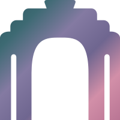
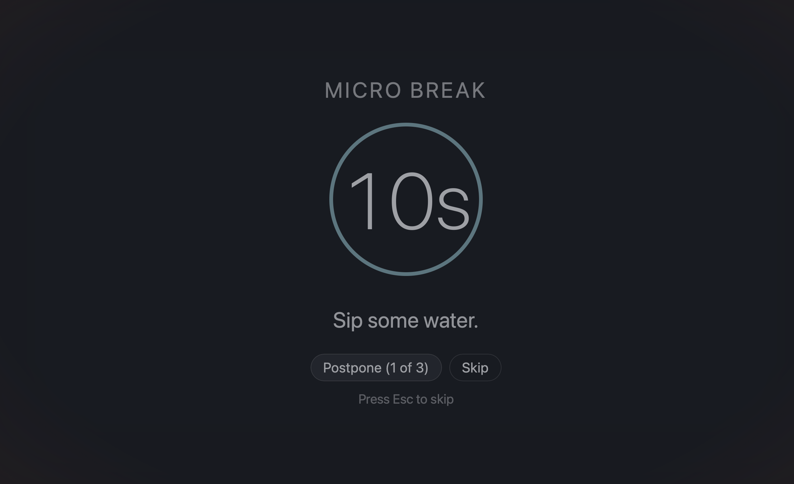
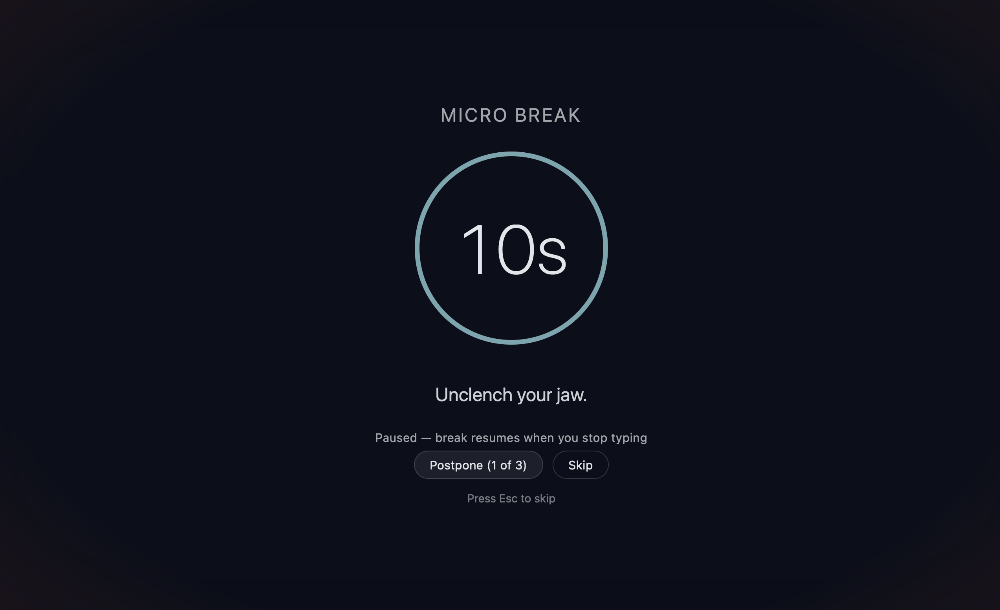
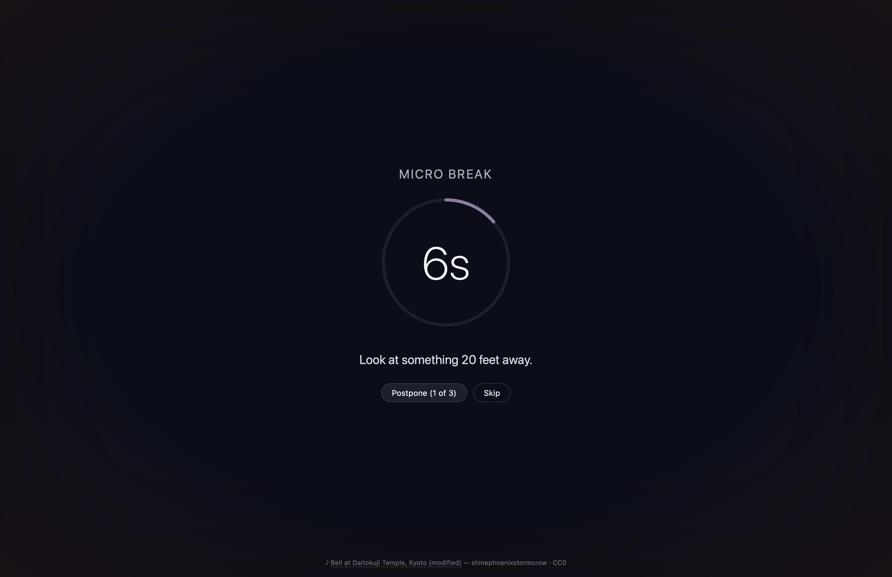
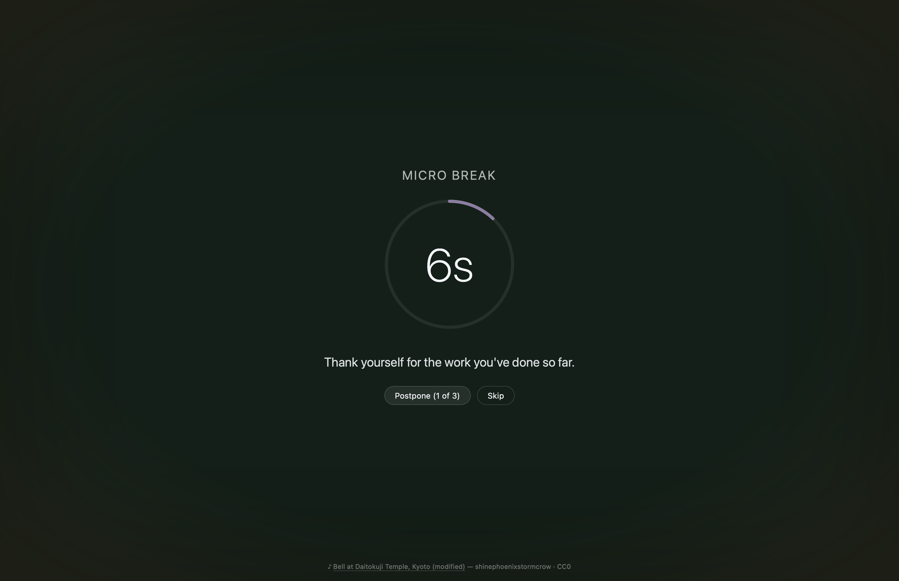
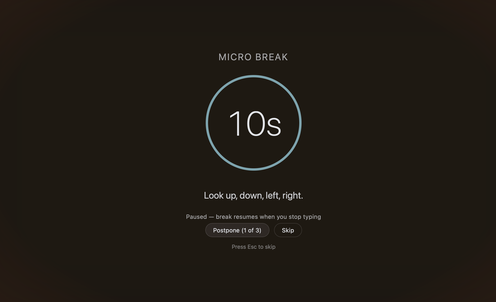
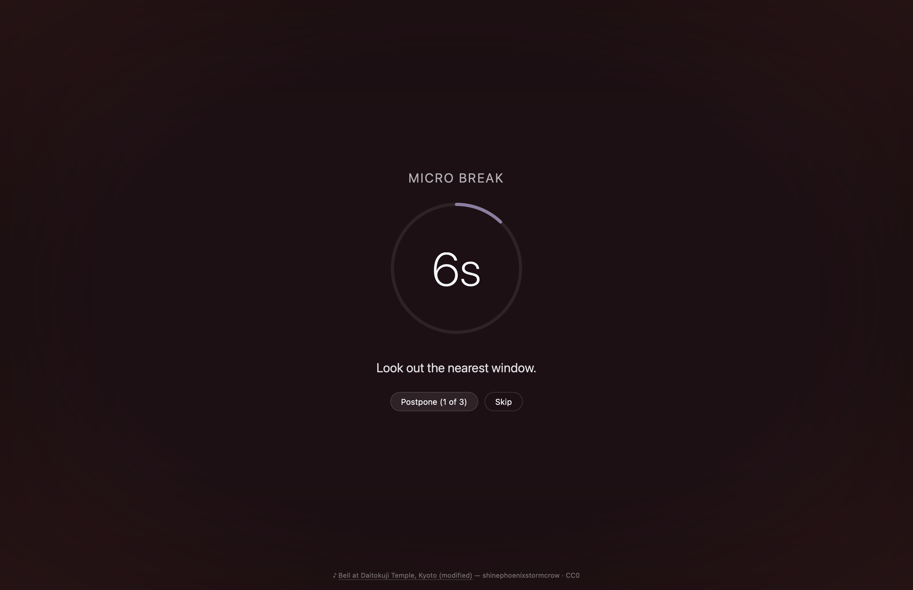
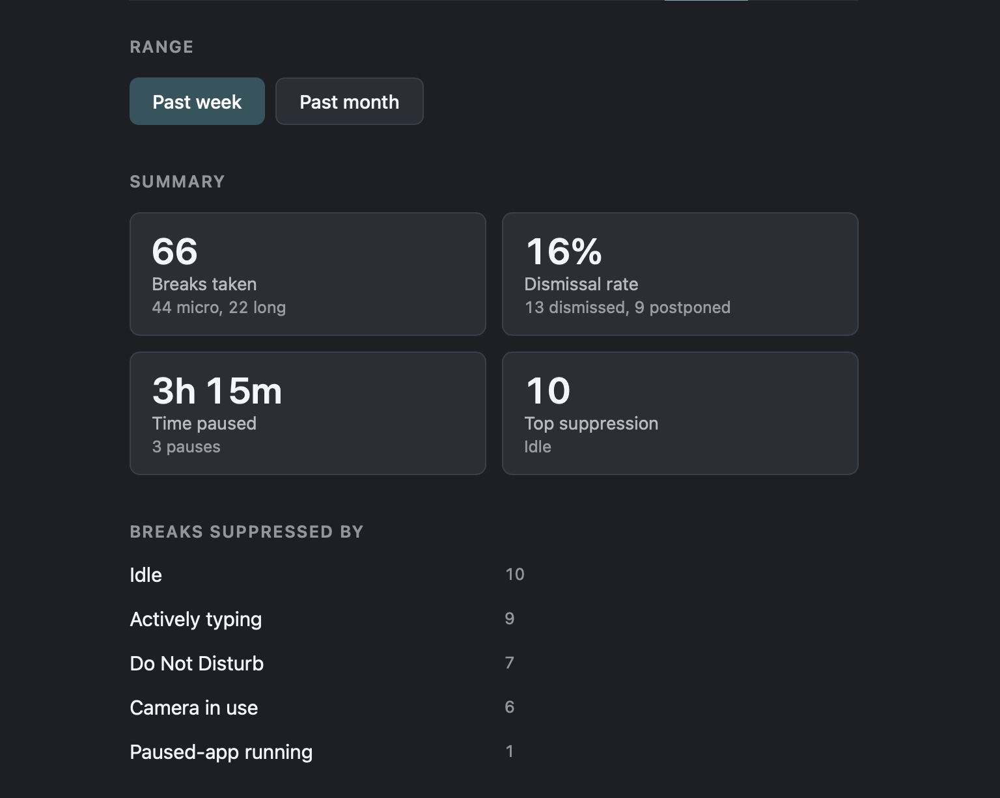
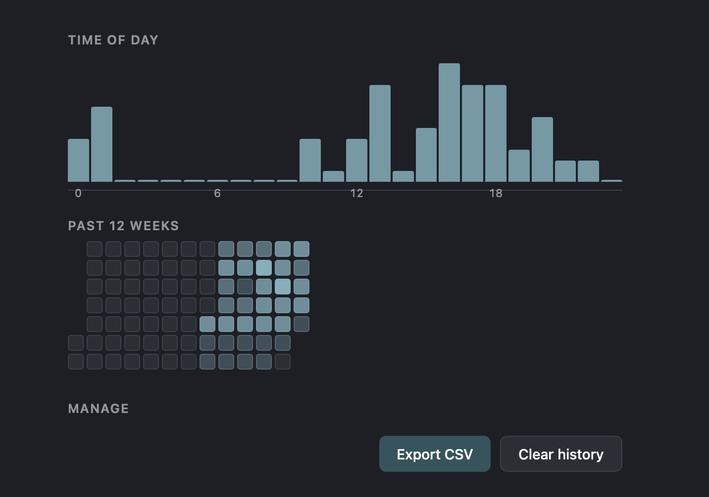

<p align="center">
  
</p>

<h1 align="center">Entracte</h1>

<p align="center">
  <em>Pronounced "ahn-TRAHKT" (French <em>entracte</em>, IPA /ɑ̃.tʁakt/) — not "en-tract".</em><br/>
  <sub><a href="https://entracte.drmowinckels.io/#how-to-say-it">🔊 Hear it on the docs site</a></sub>
</p>

<p align="center">
  A cross-platform break reminder app for macOS, Windows, and Linux —<br/>
  named after the theatre interval between acts.
</p>

<p align="center">
  Inspired by [Stretchly](https://hovancik.net/stretchly/)
</p>

[](https://github.com/drmowinckels/entracte/actions/workflows/ci.yml)
[](https://codecov.io/gh/drmowinckels/entracte)
[](https://github.com/drmowinckels/entracte/releases/latest)
[](LICENSE)

[](https://tauri.app)
[](https://claude.com/claude-code)

---

<p align="center">
  
</p>

## What it does

Entracte lives in your menu bar / tray and nudges you to take breaks. It tries hard not to interrupt:

- **Three break kinds** — short _Micro_ breaks (eye/posture, ~20s), _Long_ breaks (multi-minute), and a _Sleep_ prompt during a configurable bedtime window.
- **Skip when you shouldn't be interrupted** — pauses for system Do Not Disturb, an active camera (you're in a meeting), idle time (you already stepped away), or hours outside your work window.
- **Pause from the tray** — 15m / 30m / 1h / 2h / 4h / until tomorrow 6am / indefinitely. The tray icon shows pause bars while paused, so the state is visible at a glance.
- **Multi-monitor aware** — show breaks on every display, just the primary, or only the monitor your cursor is on, with no Space-hopping fullscreen.
- **Windowed break mode** — optionally shrink the overlay to 80% of the monitor (centered) so the rest of your desktop stays reachable while the reminder is up.
- **Pre-break heads-up** — optional notification a configurable number of seconds before each break.
- **Daily screen-time budget** — opt-in wind-down nudge when you cross a daily active-time budget (default 8 hours), with a configurable snooze interval.
- **Tray countdown** — optional `MM:SS` countdown next to the menu-bar icon, configurable to track the next short, long, or soonest break (macOS and Linux).
- **Notification-only mode** — per break kind, swap the overlay for a gentle system notification when you'd rather not be interrupted by a full-screen dim. Note that engagement metrics (completion, skip, postpone) aren't recorded for break types in notification mode, since there's no overlay to act on.

## Themes

The overlay is always dark — it has to dim everything else — but the accent and background tone follow your choice.

<p align="center">
  
  
  
  
  
</p>

## Stats

Entracte keeps a local history of breaks taken, dismissed, and suppressed, with a time-of-day breakdown and a 12-week heatmap. Export to CSV or clear at any time.

<p align="center">
  
  
</p>

## Command line

The same `entracte` binary doubles as a small CLI for scripting / hotkey wiring. Action commands forward to the running tray app:

```sh
entracte pause 30m                 # pause for 30 minutes
entracte trigger long              # fire a long break now
entracte --profile=Focus --colour=midnight   # switch profile + theme in one call
entracte status                    # JSON: pause state + active profile
entracte log                       # tail the entracte log
entracte help                      # full reference
```

Full command reference, IPC details, and tips in [docs/guide/cli.md](docs/guide/cli.md).

## Free and open

Entracte is free, cross-platform, and open source under Apache 2.0. Every scheduling, suppression, profile, hooks, stats, accessibility, and CLI feature is available to everyone.

A **Supporter pack** is in the works as a way to back development — personalisation extras like custom overlay colour, theme rotation, editable break hints, and custom sounds will unlock through a one-off purchase once the infrastructure is in place. The unlock check lives in plain source: it's an honour-system thank-you, not a DRM scheme. See [docs/guide/supporter.md](docs/guide/supporter.md).

## Stack

- React 19 + TypeScript + Vite frontend.
- Rust + [Tauri 2](https://tauri.app) + Tokio backend.
- Per-OS native hooks for Do Not Disturb, camera-in-use, and idle detection.

## Development

```sh
npm install
npm run tauri dev     # full app, hot reload on TS + Rust
npm test              # vitest, frontend unit tests
npm run audit:a11y    # build + headless Chromium + axe-core on every tab × light/dark
cargo test --manifest-path src-tauri/Cargo.toml --lib
```

The a11y audit ([scripts/audit-a11y.mjs](scripts/audit-a11y.mjs)) builds `dist/`, serves it via `vite preview`, drives Chromium through Puppeteer with a tiny `__TAURI_INTERNALS__` shim so the React tree renders normally, then runs [axe-core](https://github.com/dequelabs/axe-core) on every tab in both `prefers-color-scheme` modes. It runs on every CI build via [.github/workflows/ci.yml](.github/workflows/ci.yml) and exits non-zero on any WCAG 2.1 AA violation.

Platform support matrix, scheduler internals, and OS-specific quirks are documented in [.github/AGENTS.md](.github/AGENTS.md).

## Contributing

Bug reports, ideas, and patches are all welcome. Start with [CONTRIBUTING.md](CONTRIBUTING.md) for the setup, test, and PR workflow. Participation is governed by the [Code of Conduct](CODE_OF_CONDUCT.md), which — among the usual things — requires a real human reviewer in the loop on every contribution.

## Status

Functional and usable day-to-day on macOS. Windows and Linux build and run; some detection features (Linux DnD, Wayland idle) are still gapped — see [AGENTS.md](.github/AGENTS.md#known-gaps--next-moves).

Settings persist to a JSON file in the OS app-config dir:

- **macOS** — `~/Library/Application Support/app.entracte/`
- **Windows** — `%APPDATA%\app.entracte\`
- **Linux** — `~/.config/app.entracte/`
