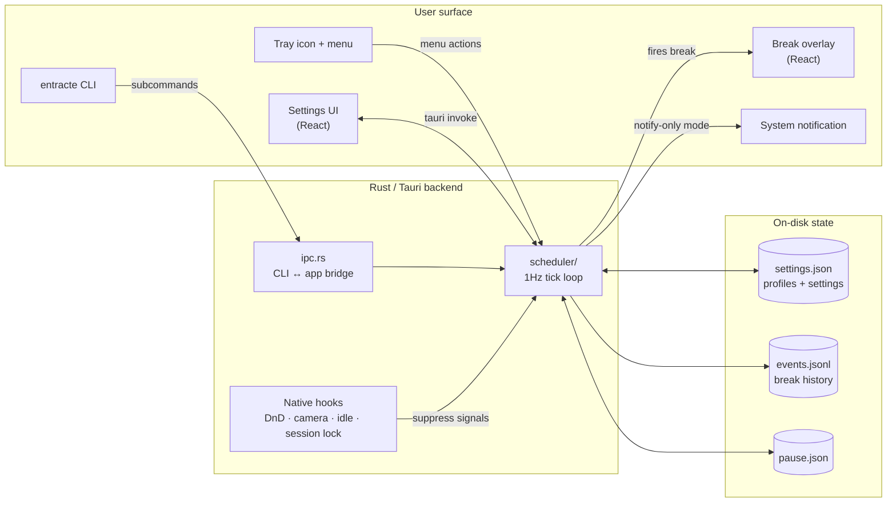

# Architecture

Entracte is a small, two-layer application: a Rust core in [Tauri 2](https://tauri.app) and a React 19 frontend. The frontend is two windows sharing one Vite bundle — a Preferences window and a fullscreen break Overlay — routed by query string.

The scheduler is the brain: a 1Hz Tokio tick loop in `src-tauri/src/scheduler/` that consults native hooks, applies pause/suppress rules, and decides when (and how) to surface a break. The tray, CLI, and settings UI all push into the same scheduler; the overlay and stats are downstream of its decisions.



## Layout

```
src-tauri/src/
  lib.rs                Tauri builder, plugin registration, invoke handlers
  main.rs               calls entracte_lib::run()
  cli.rs                argv parser + local commands + IPC wrapper
  scheduler/            the 1Hz Tokio loop and its commands
    mod.rs              Scheduler struct, spawn, persist_profiles
    run_loop.rs         the 1Hz tick
    settings.rs         Settings struct, Default, clamp
    timers.rs           per-kind interval / bedtime / typing-defer helpers
    overlay.rs          fire_break, deliver_break, monitor selection
    pause.rs            PauseState, persist/restore
    screen_time.rs      daily counter + rollover
    break_stats.rs      in-session counters + intensity
    tray_countdown.rs   tray-tick snapshot decision
    types.rs            BreakKind, BreakEvent, SuppressReason, …
    commands/           Tauri command handlers grouped by domain
  config.rs             Profiles file load/save (settings.json)
  pause_store.rs        Pause-state JSON persistence
  screen_time_store.rs  Daily screen-time JSON persistence
  stats.rs              Append-only JSONL event log + digest aggregation
  secure_io.rs          Atomic write + 0o600 perms for user-data files
  ipc.rs                Local TCP IPC server (used by the CLI)
  tray.rs               Menu bar icon, Pause-for submenu, profile picker
  hooks.rs              User-supplied shell-command execution (off by default)
  camera.rs             Per-OS camera-in-use detection
  dnd.rs                Per-OS Do Not Disturb detection
  video.rs              Per-OS video-playback detection
  diagnostics.rs        Diagnostics-report builder (redacts hooks + log lines)
  updater.rs            GitHub Releases version check
src/
  App.tsx               Window router (?window=main | overlay)
  views/
    break-overlay.tsx   The break window — countdown ring, hints, postpone/skip
    settings/           The preferences window (tabs, hooks, components)
  lib/                  Pure helpers (a11y, sounds, platform, time, color, ipc)
```

For the developer-eye-level walkthrough, see [Architecture internals](../developer/architecture-internals).

## Pieces

- **[Scheduler](./scheduler)** — the 1Hz Tokio loop that decides whether to fire a break, skip a tick, or do nothing.
- **[Per-OS detection](./per-os)** — how Do Not Disturb, camera state, and idle time are read on each platform, and where the rough edges are.

## What is _not_ here

- **No backend service.** Everything runs locally in the app process.
- **No telemetry.** No analytics, no crash reporter.
- **No SQL database.** State persists as plain JSON / JSONL files in the platform app data dir — settings + profiles in `settings.json`, pause state in `pause.json`, daily screen time in `screen_time.json`, the append-only break-event log in `events.jsonl`. See [Architecture internals → On-disk state](../developer/architecture-internals#on-disk-state) for the full table.
